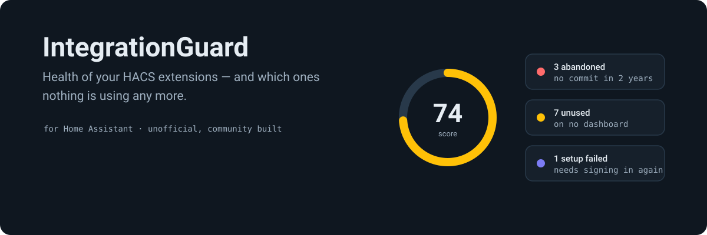
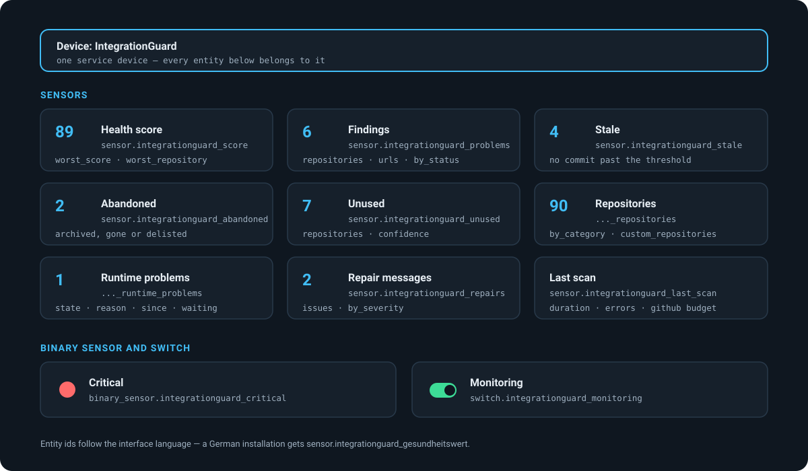
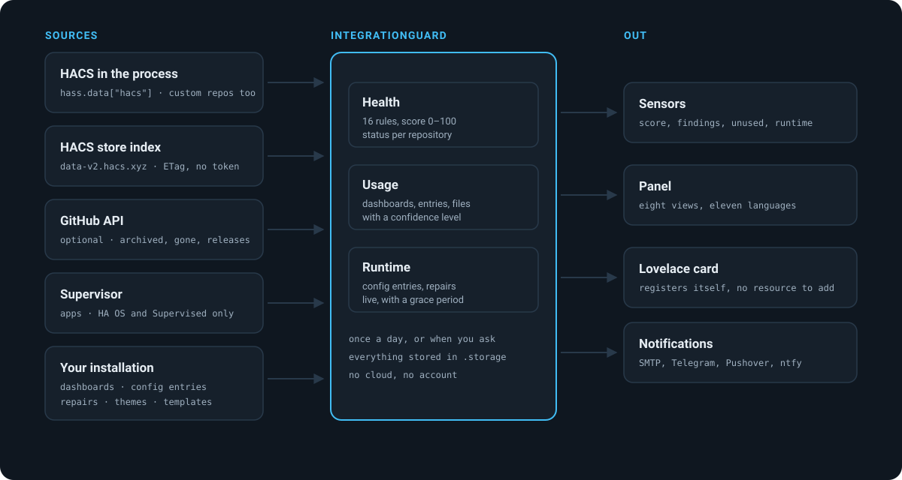
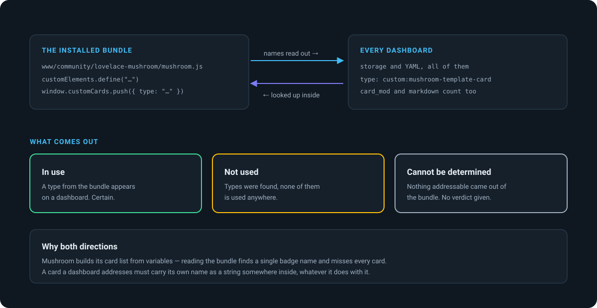
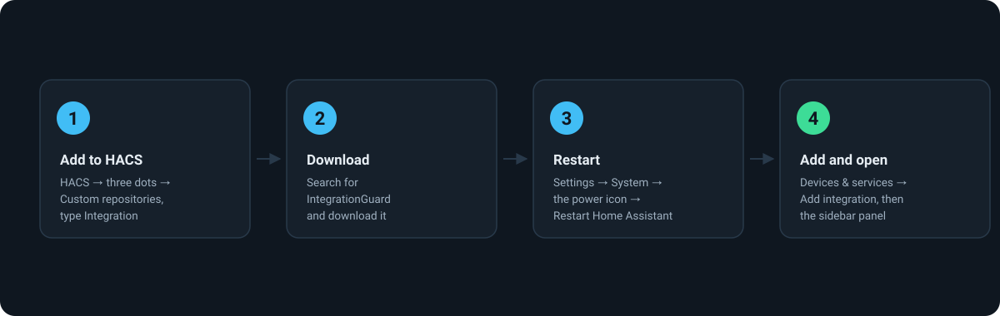
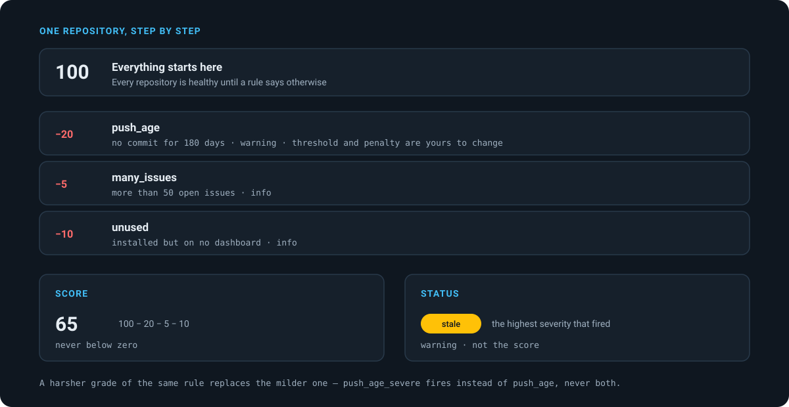
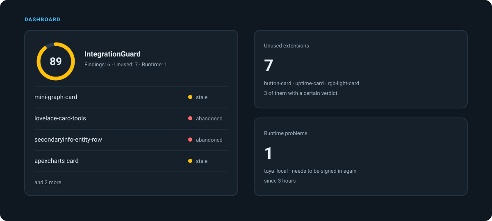

<div align="center">
  

  # IntegrationGuard — HACS Health and Unused Extension Finder for Home Assistant

  **Finds out which of your HACS extensions is no longer maintained, and which one nothing is using.**

  Reads the same public store index [HACS](https://hacs.xyz) itself uses, adds your dashboards and config entries, and tells you what to look at.

  
  
  
  

  **English** · [Deutsch](README.de.md)
</div>

## Table of contents

- [What this integration does](#what-this-integration-does)
- [Entities you get](#entities-you-get)
- [How it works](#how-it-works)
- [How unused cards are found](#how-unused-cards-are-found)
- [Installation](#installation)
- [Configuration](#configuration)
- [The rules](#the-rules)
- [Automation examples](#automation-examples)
- [Dashboard example](#dashboard-example)
- [Troubleshooting](#troubleshooting)
- [FAQ](#faq)
- [What it deliberately does not do](#what-it-deliberately-does-not-do)
- [Credits](#credits)
- [Disclaimer](#disclaimer)
- [Contributing](#contributing)
- [License](#license)

## What this integration does

A Home Assistant instance collects extensions. After two years you have ninety of
them, and no idea which ones are still being worked on, which ones you stopped
using, and which one is quietly broken. IntegrationGuard answers all three.

**Is it still maintained?** Last commit, newest release, archived on GitHub,
repository deleted, removed from the HACS store, on the HACS security list, only
prereleases, needs a newer Home Assistant than you run. Sixteen rules, each one
switchable and reweightable.

**Is anything using it?** A card that is on no dashboard. An integration with no
config entry. A theme nobody selected. A python_script nothing calls. Plus the
leftovers — Lovelace resources pointing at files that are gone, folders in
`custom_components` that HACS does not know about.

**Does it work?** Config entries that failed to set up, integrations asking to be
signed in again, and Home Assistant's own repair messages — watched live, not
once a day.

Apps (formerly add-ons) are judged the same way on Home Assistant OS and
Supervised: their store repository is checked like any other, plus whether the
author marked the app deprecated, whether the Supervisor still offers it, and
whether it is installed but never started.

## Entities you get



| Entity | Example | What it holds |
| --- | --- | --- |
| `sensor.integrationguard_score` | `89` | Mean health score. Attributes name the worst repository, which a mean would otherwise hide |
| `sensor.integrationguard_problems` | `6` | Repositories with at least one finding, with a GitHub link each |
| `sensor.integrationguard_stale` | `4` | No commit past the threshold |
| `sensor.integrationguard_abandoned` | `2` | Archived, deleted or delisted |
| `sensor.integrationguard_unused` | `7` | Installed, but nothing here uses it — with a confidence level |
| `sensor.integrationguard_repositories` | `90` | Everything installed, split by category |
| `sensor.integrationguard_runtime_problems` | `1` | Config entries that are not working |
| `sensor.integrationguard_repairs` | `2` | Home Assistant repair messages on watched integrations |
| `sensor.integrationguard_last_scan` | timestamp | Duration, source errors, remaining GitHub budget |
| `binary_sensor.integrationguard_critical` | `off` | On when something is archived, gone or flagged |
| `switch.integrationguard_monitoring` | `on` | Pauses the schedule. A scan you ask for still runs |

Entity ids follow the interface language: a German installation gets
`sensor.integrationguard_gesundheitswert`.

## How it works



Four sources, in this order:

1. **HACS in the running process.** Everything HACS downloaded, including the
   custom repositories that are in no store. On a typical installation that is a
   quarter of everything you have.
2. **The public HACS store index** at `data-v2.hacs.xyz` — the same data your
   HACS already fetches. No token, no account, and a conditional request costs
   nothing when nothing changed. This is also where the removed-from-HACS and
   security lists come from.
3. **GitHub**, optional and only for what the first two cannot answer: archived,
   repository gone, and the date of the newest release. Without a token GitHub
   allows 60 requests an hour; conditional requests that answer *not modified*
   do not count against that, so only the first run is slow.
4. **Your installation** — dashboards, config entries, repairs, themes, the
   configuration directory.

Everything is stored in `.storage`. Nothing leaves the machine except the two
read-only requests above.

## How unused cards are found



Reading the element names out of a bundle is the obvious approach, and it is not
enough. Mushroom builds its card list from variables — a regular expression
finds one badge name and misses every card. So the check runs in both
directions: the names read out of the bundle, **and** every `custom:` type the
dashboards ask for looked up as a string inside the bundle. A card a dashboard
addresses has to carry its own name somewhere, whatever it does with it.

Only a plugin that **announces a card of its own** — through
`window.customCards` or one of its siblings — can ever be called unused. Without
that announcement there is no telling what a dashboard would have to write to
use it, so the answer is **cannot be determined**. That is what keeps card-mod,
card-tools, kiosk-mode, custom-sidebar and the icon sets out of the results.
Reading element names out of a bundle is not enough to say the opposite:
libraries define elements too.

Some plugins are not addressed as a card at all but through a key of their own —
card-mod is switched on by writing `card_mod:` under a card. Those keys are read
out of the dashboards as well, so a plugin used that way is recognised.

Where a **strategy dashboard** is in use, the confidence drops one level: a
strategy decides at render time what to show, and that cannot be read from the
stored configuration. The automatically generated default dashboard does not
count — Home Assistant builds it from the entity registry and can never put a
custom card in it.

## Installation



### Through HACS

1. HACS → the three dots → **Custom repositories**
2. URL `https://github.com/sphings79/integrationguard-home-assistant`, type **Integration**
3. Search for **IntegrationGuard** and download it
4. Restart Home Assistant
5. Settings → Devices & services → **Add integration** → IntegrationGuard

### By hand

Copy `custom_components/integrationguard` into your `config/custom_components`
directory and restart.

The Lovelace card registers itself — there is no resource to add. With a
YAML-mode dashboard, add it yourself:

```yaml
resources:
  - url: /integrationguard-frontend/integrationguard-card.js
    type: module
```

## Configuration

The config flow asks for one optional thing: a GitHub token. Everything else
lives in the **IntegrationGuard** panel in the sidebar.

| Setting | Default | What it changes |
| --- | --- | --- |
| Check every | 24 hours | How often a scan runs |
| Anchored at | 04:00 | The daily time. With a six hour interval: that time, then every six hours |
| GitHub token | empty | 60 requests an hour without, 5000 with. Read access to public repositories is enough |
| Check health of | all categories | Which kinds of thing are judged |
| Check usage of | all but AppDaemon | Which kinds are checked for being used |
| Look for leftovers | on | Dead Lovelace resources and unknown folders |
| Watch config entries | on | The runtime pillar |
| All integrations | off | On: core integrations too, not just the ones from HACS |
| Grace period | 15 minutes | How long a retrying config entry stays quiet |
| Quiet hours | off | Notifications are held and go out afterwards |
| Panel access | administrators | Or everyone |
| Keep history for | 365 days | Retention of the change log |

A GitHub token is created under **Settings → Developer settings → Personal access
tokens**. The token needs **no permissions at all** — GitHub grants every token
read-only access to public repositories. Do not tick anything.

## The rules



Every repository starts at 100. Each rule that fires subtracts its penalty. The
**status** is not derived from the score but from the highest severity that
fired — otherwise five harmless findings would outweigh one archived repository.

| Rule | Default threshold | Severity | Penalty |
| --- | --- | --- | --- |
| On the HACS security list | — | security | 100 |
| Repository deleted | — | critical | 60 |
| Archived on GitHub | — | critical | 50 |
| Removed from the HACS store | — | critical | 50 |
| App store repository gone | — | critical | 50 |
| No commit for | 545 days | critical | 45 |
| App marked deprecated | — | critical | 45 |
| No commit for | 180 days | warning | 20 |
| Newest release older than | 730 days | warning | 20 |
| App no longer offered | — | warning | 20 |
| Wants a newer Home Assistant | — | warning | 15 |
| Newest release older than | 365 days | info | 10 |
| Not used anywhere | — | info | 10 |
| More open issues than | 50 | info | 5 |
| Fewer stars than | 5 | info | 5 |
| No release at all | — | info | 5 |
| Only prereleases | — | info | 5 |
| Update available | — | info | 5 |
| Installed from a branch | — | info | 5 |

Rules that come in two grades never both fire: the harsher one replaces the
milder one. Rules that only make sense for one kind of thing are restricted to
it — an app has no HACS release, so *no release at all* never fires on one.

Severities decide the status through their priority: from 90 critical, from 80
abandoned, from 50 stale, below that worth a look. Rename them, recolour them,
repoint any rule at any of them.

## Automation examples

React to a repository turning bad:

```yaml
automation:
  - alias: Tell me when an extension is abandoned
    triggers:
      - trigger: event
        event_type: integrationguard_status_changed
        event_data:
          status: abandoned
    actions:
      - action: notify.mobile_app_phone
        data:
          title: "{{ trigger.event.data.name }} looks abandoned"
          message: "{{ trigger.event.data.url }}"
```

React to an integration falling over, without waiting for the daily scan:

```yaml
automation:
  - alias: Tell me when an integration needs signing in again
    triggers:
      - trigger: event
        event_type: integrationguard_runtime_changed
    conditions:
      - condition: template
        value_template: "{{ trigger.event.data.state == 'reauth' }}"
    actions:
      - action: persistent_notification.create
        data:
          title: "{{ trigger.event.data.domain }} needs attention"
          message: "{{ trigger.event.data.reason }}"
```

A weekly reminder of what is lying around:

```yaml
automation:
  - alias: Sunday cleanup
    triggers:
      - trigger: time
        at: "10:00:00"
    conditions:
      - condition: time
        weekday: [sun]
      - condition: numeric_state
        entity_id: sensor.integrationguard_unused
        above: 0
    actions:
      - action: notify.mobile_app_phone
        data:
          message: >-
            {{ states('sensor.integrationguard_unused') }} extensions are
            installed but unused:
            {{ state_attr('sensor.integrationguard_unused', 'repositories')
               | join(', ') }}
```

Available events: `integrationguard_scan_completed`,
`integrationguard_status_changed`, `integrationguard_runtime_changed`. Available
actions: `integrationguard.scan`, `.ignore`, `.unignore`, `.mark_used`.

## Dashboard example



```yaml
type: custom:integrationguard-card
title: Extensions
max_items: 6
min_status: stale
show_score: true
show_runtime: true
```

| Option | Default | What it does |
| --- | --- | --- |
| `title` | the integration name | Heading of the card |
| `max_items` | `5` | Most rows before "and N more" |
| `min_status` | `info` | Only show this status and worse |
| `show_score` | `true` | The score ring on the left |
| `show_runtime` | `true` | Include runtime problems |

The card has a visual editor, so none of this has to be typed.

## Troubleshooting

**Everything is empty and the last scan reports `hacs: unavailable`.**
HACS is not loaded. IntegrationGuard reads the repositories out of the running
HACS instance; without it there is nothing to look at. The previous result is
kept rather than replaced with an empty one.

**Repositories keep saying "waiting for GitHub".**
Without a token GitHub allows 60 requests an hour. Ninety repositories therefore
take a couple of hours on the first run, spread over several scans. Every answer
is stored, and from the second day on almost every request is a conditional one
that does not count against the limit. A token removes the wait.

**A card is reported as unused although I use it.**
Check whether the dashboard is built by a strategy — those decide at render time
and cannot be read. Use **Mark as used** in the repository detail; the verdict
stays overridden.

**The panel is not in the sidebar.**
It is admin-only by default. Either sign in as an administrator or set panel
access to everyone in the settings.

**An integration shows `not_loaded` although it works.**
That is a config entry that exists but is not loaded — usually a leftover from
an integration you removed. Home Assistant shows it under Devices & services.

## FAQ

### Does this send my data anywhere?

No. Two read-only requests leave the machine: the public HACS store index, and
GitHub's public API for repositories you already installed. No account, no
telemetry, nothing about your entities or your home.

### Do I need a GitHub token?

No. Without one you get 60 requests an hour, which is enough for a daily check
once the first pass is done. A token raises it to 5000 and makes the first run
take minutes instead of hours.

### Does it work without HACS?

No. The repository list comes from HACS. Apps on Home Assistant OS are read from
the Supervisor and would work on their own, but the integration is built around
HACS being there.

### Will it delete anything?

Never. It does not update, uninstall or modify anything. It reads, judges and
reports.

### Why is my own repository reported as having no stars?

Because it has none. Turn the *fewer stars than* rule off, or set its threshold
to zero — that rule says more about popularity than about health.

### Does it work on a Home Assistant Container installation?

Yes, except for apps: those need a Supervisor, so the category simply stays
empty on Container and Core installations.

### How does it tell a card library from an unused card?

It does not have a list. If nothing addressable can be read out of a bundle, the
verdict is "cannot be determined". Libraries are used through other means and
register no card type, so they land there by themselves.

### Can I silence one repository?

Yes, in the repository detail or through `integrationguard.ignore`, optionally
only for a while. An ignored repository counts towards nothing.

## What it deliberately does not do

- **No updating.** That is HACS' job.
- **No uninstalling.** It shows, it does not clean up.
- **No judging core integrations.** Only what came through HACS, plus apps.
- **No entity monitoring.** Whether a device answers is a different question —
  that is what [StateGuard](https://github.com/sphings79/stateguard-home-assistant)
  is for.

## Credits

**[HACS](https://hacs.xyz)** by [Joakim Sørensen](https://github.com/ludeeus)
and its contributors. IntegrationGuard reads the repositories out of the running
HACS instance and uses the public store index at `data-v2.hacs.xyz` — the same
data HACS itself fetches. Source: [hacs/integration](https://github.com/hacs/integration).
HACS is free software and takes [donations](https://github.com/sponsors/ludeeus).

**[GitHub](https://github.com)** for the public repository API. Used
unauthenticated by default, within the documented
[rate limits](https://docs.github.com/rest/using-the-rest-api/rate-limits-for-the-rest-api).

Neither project is involved in this one.

## Disclaimer

Unofficial and community built. Not affiliated with, endorsed by or supported by
the Home Assistant project, Nabu Casa, HACS or GitHub. "Home Assistant" is a
trademark of the Home Assistant project.

A verdict of *abandoned* or *unused* is a hint, not a fact. Check before you
remove anything.

## Contributing

Issues and pull requests are welcome at
[sphings79/integrationguard-home-assistant](https://github.com/sphings79/integrationguard-home-assistant).
Before pushing:

```bash
ruff format . && ruff check . && pytest
```

For the frontend:

```bash
cd frontend && npm ci && npx tsc --noEmit && npm run build
```

The built bundle is committed — HACS does not run a build step — and CI checks
that it matches the sources.

## License

MIT. See [LICENSE](LICENSE), attribution in [NOTICE](NOTICE).

---

<sub>Home Assistant HACS health check · find unused HACS integrations · find unused Lovelace cards · abandoned custom component detector · HACS repository maintenance status · unused custom cards Home Assistant · Home Assistant add-on health · HACS cleanup · custom integration not maintained · Home Assistant repair messages</sub>
